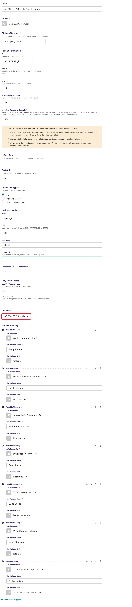
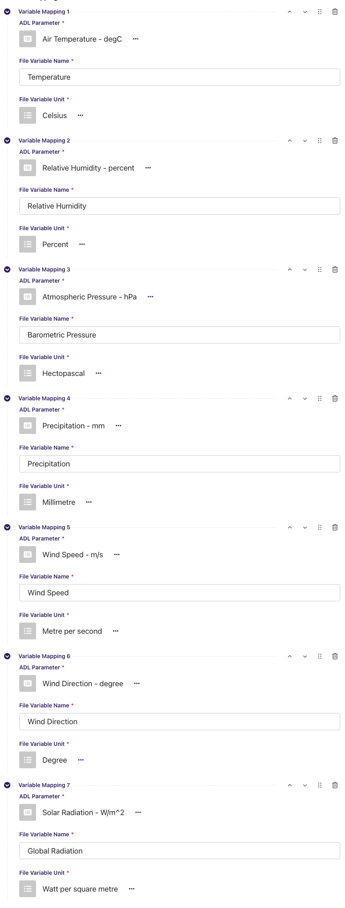
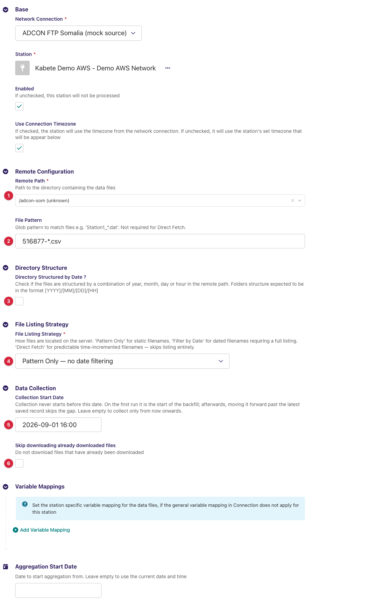
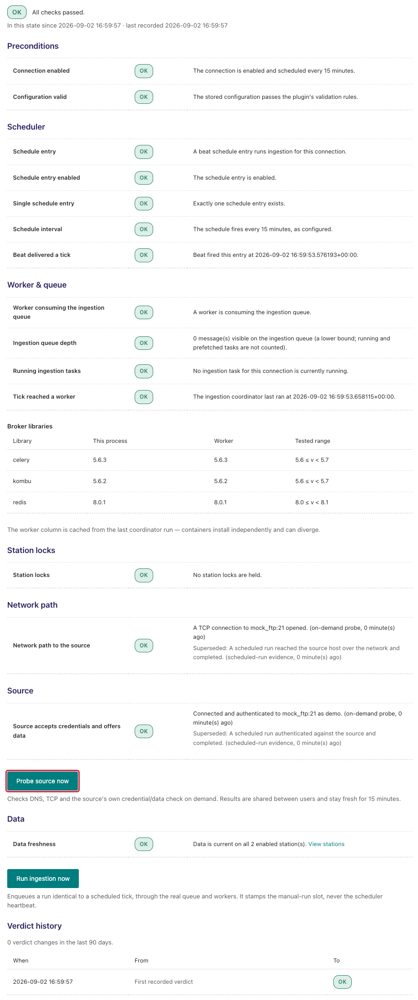
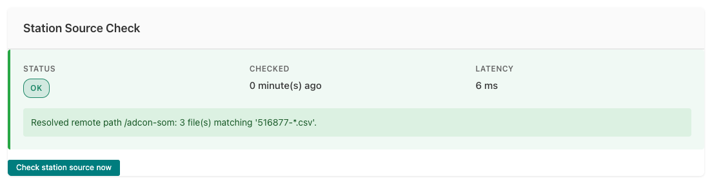
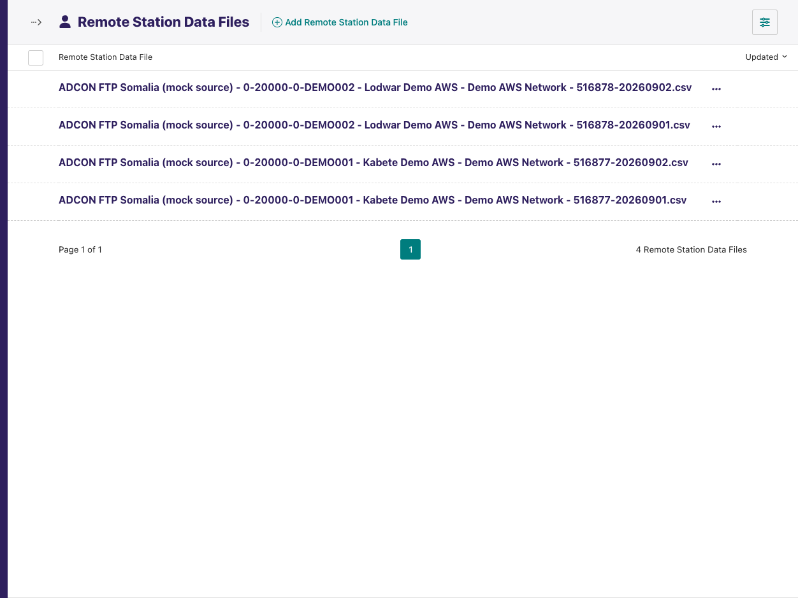

# ADL ADCON FTP Somalia Plugin

Adds a **decoder** to the [ADL FTP Plugin](https://github.com/wmo-raf/adl-ftp-plugin)
for the CSV observation export files that the **ADCON addVANTAGE** server of
Somalia's meteorological service pushes to an FTP server: one comma-separated
file per station and day, a station id column, split date/time columns and a
time-zone column. With this plugin installed, an ADL FTP/SFTP connection can
select **ADCON FTP Somalia** as its decoder and collect those files like any
other FTP source.

**Repository:** [adl-ftp-adcon-som-plugin](https://github.com/wmo-raf/adl-ftp-adcon-som-plugin)
**Plugin type identifier:** `adl_ftp_adcon_som_plugin` (registry entry only — see below)
**Decoder identifier:** `adcon_som` · **Decoder display name:** *ADCON FTP Somalia*
**Connection model:** none of its own — uses the FTP plugin's `NetworkFTP` · **Station link model:** the FTP plugin's `FTPStationLink`

> **About the screenshots.** Every image in this guide is regenerated from
> `docs/screenshots.yml` against a seeded demo instance, so hostnames, station
> names, ids and readings in them are placeholders — not values to copy. The
> field tables are the reference for what to enter.

## Overview

This is a *decoder plugin*: it defines no connection or station link of its
own and never talks to a server. The FTP plugin does the listing and
downloading; this plugin turns each downloaded file into observation records.

```
addVANTAGE export ──▶ FTP server ──▶ ADL FTP Plugin (list, match, download)
                                          │
                                          ▼
                              ADCON FTP Somalia decoder (this plugin)
                                          │
                                          ▼
                       records ──▶ variable mappings ──▶ ADL observations
```

Although the plugin registers itself in the ADL plugin registry (as every
plugin package must), **you never choose it as a connection's plugin**. The
connection's plugin is *ADL FTP Plugin*; this plugin appears only as an entry
in that connection's **Decoder** list. Everything about hosts, credentials,
paths, listing strategies, downloads and the monitoring screens is documented
in the [ADL FTP Plugin guide](https://github.com/wmo-raf/adl-ftp-plugin/blob/main/docs/guide.md);
this guide covers what is specific to the Somalia files.

## Prerequisites

- A running ADL instance with the **ADL FTP Plugin** installed (this plugin
  imports from it and cannot load without it).
- FTP/SFTP access to the server the addVANTAGE export writes to — host, port,
  account, and the directory holding the files (see the FTP plugin guide's
  prerequisites for the network side).
- Files in the expected layout (next section).

## Installation

Installed like any ADL plugin — see the core *Plugin Installation* page for all
methods. Both entries are needed in `plugins.toml`, the FTP plugin first:

```toml
[[plugins]]
name = "ADL FTP Plugin"
git  = "https://github.com/wmo-raf/adl-ftp-plugin.git"
tag  = "0.13.0"

[[plugins]]
name = "ADL ADCON FTP Somalia Plugin"
git  = "https://github.com/wmo-raf/adl-ftp-adcon-som-plugin.git"
tag  = "0.0.2"
```

After rebuild/restart, confirm both appear in `docker compose exec adl
list-plugins`, and that *ADCON FTP Somalia* is offered in the Decoder list of
a new FTP connection. Use **0.0.2 or later**: 0.0.1 produces no
observations on the current FTP plugin and ADL core (see Compatibility).

## The file format this decoder reads

| Aspect | Expected |
|---|---|
| File name | Any name the export uses; the decoder finds the day as a `YYYYMMDD` string **anywhere in the name** (e.g. `516877-20250224.csv`). |
| Encoding / separators | Text, **comma**-separated, dot decimal, a header row. |
| Header row | `StationID,Date,Time,Time zone,Barometric Pressure,Global Radiation,Precipitation,Relative Humidity,Temperature,Dew point,Wind Direction,Wind Speed,Battery Voltage` — four fixed columns (`StationID`, `Date`, `Time`, `Time zone`) and one column per measured variable. Each variable's header is what you enter as *File Variable Name*. |
| Sample row | `516877,24/02/2025,00:15:00,EAT,969.0,0.0,0.0,61.3,25.7,17.7,95.9,9.5,6.65` |
| `Date` / `Time` | `DD/MM/YYYY` and `HH:MM:SS`. |
| `Time zone` | Read and dropped — the decoder does not use it. Times are taken as the station's local time in ADL (the connection's *Stations Timezone*, or the station link's own). |
| Values | Numeric; a cell that is not a number is stored as missing for that variable and row. |

## Connection configuration

Create a **Network FTP/SFTP** connection exactly as the FTP plugin guide
describes (connection type, host, port, username, password, passive mode,
timeout), then:

| Field | Value for this source |
|---|---|
| Decoder | **ADCON FTP Somalia** |
| CSV Configuration | Leave empty — this decoder needs no configuration. |
| Variable Mappings | One row per column to store (below). Connection-level mappings apply to every station on the connection, which suits this source since all stations share the same export layout. |



### Variable mappings

| Field | Description |
|---|---|
| ADL Parameter | The ADL `DataParameter` the values are stored under. |
| File Variable Name | The column header **exactly** as in the file: `Temperature`, `Relative Humidity`, `Barometric Pressure`, `Precipitation`, `Wind Speed`, `Wind Direction`, `Global Radiation`, `Dew point`, `Battery Voltage`. |
| File Variable Unit | The unit the export writes that column in (the sample above is in °C, %, hPa, mm, m/s, degrees, W/m²); ADL converts from it to the ADL parameter's unit. |



**Example:** ADL Parameter `Air Temperature` ← File Variable Name
`Temperature`, unit `degC`.

The FTP plugin's **Test Decoder Configuration** action on the connection row
(see its guide) decodes one uploaded file with this decoder and shows the
records — use it to confirm the headers before typing the mappings.

## Station link configuration

Create an **FTP/SFTP Station Link** per station (all fields are the FTP
plugin's; only the values matter here):

| Field | Value for this source |
|---|---|
| Remote Path | The directory the export writes into. |
| File Pattern | A glob selecting one station's files, e.g. `516877-*.csv` if the file names start with the addVANTAGE station id. |
| Directory Structured by Date | Off, unless the export nests directories by year/month/day on your server. |
| Date Granularity | Leave it alone. The field only appears when *Directory Structured by Date* is on, so in the configuration above you never see it — and an empty granularity is exactly what this decoder wants: it falls back to **day** and builds one date per day from the start date to today. |
| File Listing Strategy | **Pattern Only**. The date narrowing is done by this decoder; *Filter by Date* and *Direct Fetch* do not apply. |
| Collection Start Date | The earliest day whose file should be considered. **With no start date, only today's file is looked at** — set it for any backfill. |
| Skip downloading already downloaded files | A day's file grows through the day; with this on, a file fetched once is not fetched again. Turn it **off** on this source so the current day's file is re-downloaded each run (already-saved rows are not duplicated). |



## Admin UI added by this plugin

None. This plugin adds no page, menu entry, button or form of its own; the
only place it appears is as an option in the FTP connection's *Decoder*
select. The FTP plugin's own surfaces — *Test Decoder Configuration*, the
*Direct Fetch Files* preview, the *FTP station data files* list — work with
this decoder and are documented in the FTP plugin guide.

## Data collection behavior

One run, per enabled station link:

1. The FTP plugin lists *Remote Path* and keeps the names matching *File
   Pattern*.
2. This decoder narrows them to files whose name contains one of the dates
   from *Collection Start Date* (or today, if empty) up to today, as
   `YYYYMMDD` strings.
3. The FTP plugin downloads each file not yet held (or every file, with
   *Skip downloading already downloaded files* off) and hands it to the
   decoder.
4. The decoder reads the CSV, converts each variable column to a number,
   builds a timestamp from `Date` + `Time`, drops the `Date`, `Time` and
   `Time zone` columns, and yields one record per row.
5. ADL applies the variable mappings and unit conversion and stores the
   values. Every decoded row is saved unless it is older than *Collection
   Start Date*; rows already stored are updated, not duplicated.

- **Timezones:** file times are treated as the station's local time; the
  `Time zone` column is ignored.
- **Backfill:** set *Collection Start Date* before the first run.

## Source checks / diagnostics

All monitoring for a connection using this decoder is the FTP plugin's: the
**Ingestion Diagnostic** page proves the FTP host, port and account, and the
station link's **Station Source Check** proves the resolved remote path and
counts the files matching the pattern. Their messages are catalogued in the
FTP plugin guide. This plugin adds no check of its own — a file that lists
and downloads fine but does not decode shows up as a **run failure or a
warning in the activity log**, not in the source checks.





The FTP plugin's **FTP station data files** list (Snippets → FTP station data
files) shows every file fetched for a station link with its *processed* time
and *values saved* count — the first place to look when a file arrived but
nothing was stored.



### Feedback catalogue — messages involving this decoder

These appear in the station's activity log message or the run's task log
(Monitoring → the connection's activity):

| Message (example) | Where | Meaning | What to do |
|---|---|---|---|
| `TypeError: AdconSOMDecoder.get_matching_files() takes 3 positional arguments but 5 were given` | run failure, every station | This plugin is at 0.0.1 on an FTP plugin of 0.10.0 or later, which calls decoders with a date window that release does not accept. | Upgrade this plugin to 0.0.2 or later; there is no configuration workaround. |
| `Missing observation_time for station …` | task log (warning), once per row | This plugin is at 0.0.1, whose decoder emitted the timestamp as `TIMESTAMP`; the ADL core stores a record only when it carries `observation_time`, so every row was skipped. | Upgrade this plugin to 0.0.2 or later. |
| `Error decoding file 516877-20250224.csv: 'Date'` (or `'Time'`, `'Time zone'`) | task log | The file has no column of that name — a different export layout. | Open the file: the header must contain `Date`, `Time` and `Time zone`. |
| `Error decoding file …: time data '24/02/202500:15:00' does not match format '%d/%m/%Y%H:%M:%S'` | task log | `Date`/`Time` are not `DD/MM/YYYY` / `HH:MM:SS`. | Check the export's date and time formats. |
| `File 516877-20250224.csv decoded 96 record(s) but none of its values were saved — check the variable mappings and the ingestion window` | task log (warning) | The file parsed, but nothing was stored: no mapping matched a column, or every row is older than *Collection Start Date* (on 0.0.1, every row lacked `observation_time`). | Compare mapping names with the headers character for character; check *Collection Start Date*. |
| `Resolved remote path /export: 0 file(s) matching '516877-*.csv'.` | Station Source Check (OK) | The FTP plugin's station check: path found, nothing matches right now. | Fine at day start before the first export; otherwise check the pattern. |

## Troubleshooting

**Every station fails immediately with a `TypeError` about `get_matching_files`**
: The installed plugin is 0.0.1, which predates the FTP plugin's dated
  decoder API (FTP plugin 0.10.0). Upgrade to 0.0.2 or later; nothing in the
  configuration fixes it.

**Files decode (Test Decoder Configuration shows rows) but nothing is stored, and the task log is full of `Missing observation_time`**
: The installed plugin is 0.0.1, whose records carried `TIMESTAMP` instead of
  `observation_time`. Upgrade to 0.0.2 or later.

**Only today's file is ever collected**
: *Collection Start Date* is empty. The decoder's date list starts at the
  start date, or today when there is none.

**Today's file stops growing in ADL after the first fetch**
: *Skip downloading already downloaded files* is on. Turn it off for this
  source.

## Compatibility

| Plugin version | Requires | Notes |
|---|---|---|
| 0.0.2 | ADL FTP Plugin >= 0.10.0 (written against 0.13.0), ADL core 0.8.x | Current release. Accepts the FTP plugin's dated decoder API and emits `observation_time`. |
| 0.0.1 | ADL FTP Plugin < 0.10.0 | Do not use: every run on a current FTP plugin fails with a `TypeError` before any file is downloaded (issue #4), and the decoder named its timestamp `TIMESTAMP`, which the ADL core does not read, so no record was ever stored (issue #5). Both fixed in 0.0.2. |

## Changelog

See [GitHub Releases](https://github.com/wmo-raf/adl-ftp-adcon-som-plugin/releases).
